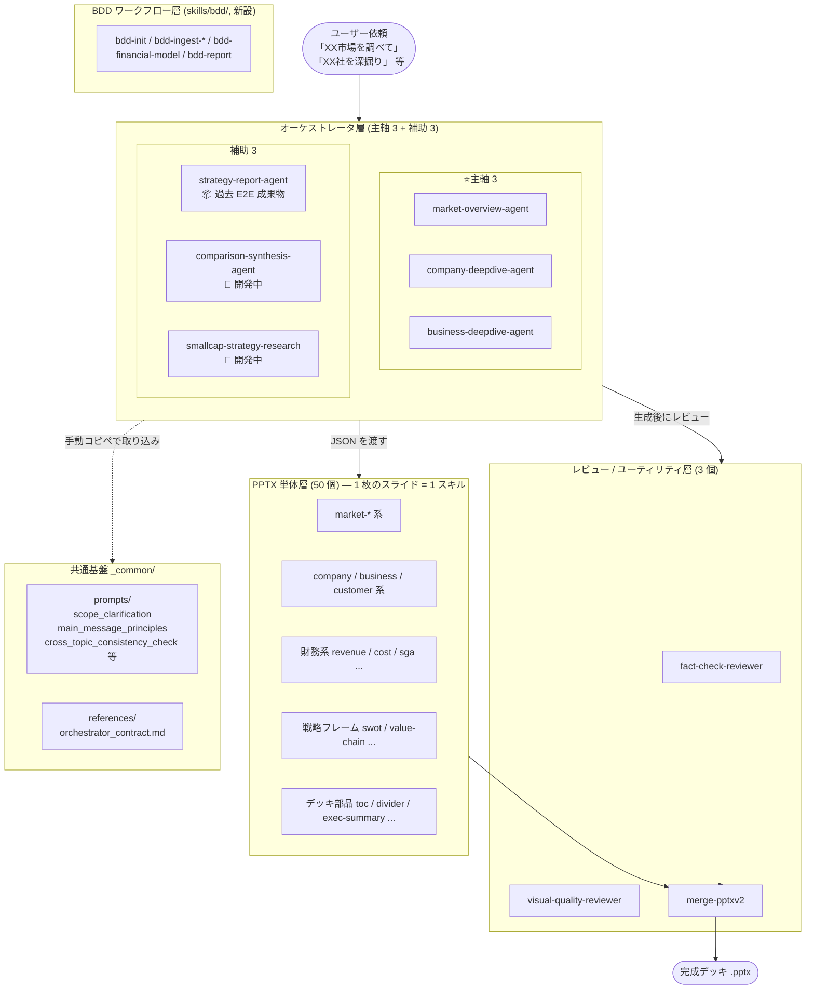
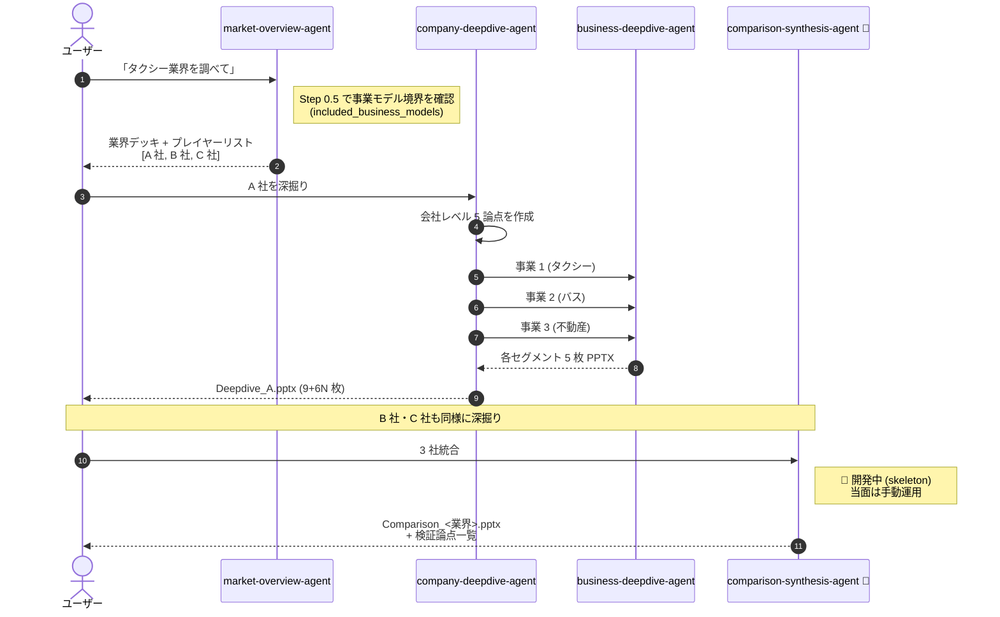

# skills_factory 全体像ガイド

> **対象読者**: 戦略コンサル業務担当の社内チームメンバー
> **目的**: 「どんな依頼が来たら、どのスキルを起動すればよいか」を俯瞰する
> **時点**: 2026-05-01（ISSUE-004 クローズ後のスナップショット。3 主軸エージェント体制に再整理）

---

## 1. はじめに

`skills_factory` は、戦略コンサルタント業務（市場調査・BDD・競合分析・M&A ターゲット評価・新規参入調査等）で繰り返し作成する **PowerPoint デッキを Claude Code 上で自動生成する Skill 群** を提供するプロジェクトです。

業務上の「同じようなスライドを毎回手で作る」苦痛を、以下の 2 段構えで解消します:

1. **PPTX 単体スキル（50 個）**: 「市場規模推移 1 枚」「SWOT 1 枚」「会社沿革 1 枚」のような **1 枚のスライド** を JSON 入力から生成
2. **オーケストレータエージェント（主軸 3 + 補助 3）**: ユーザーの「○○市場を調べて」レベルの依頼を受け、Web 検索を走らせ、複数の PPTX 単体スキルを束ねて **デッキ 1 本** に仕上げる
   - **主軸 3** = `market-overview-agent` / `company-deepdive-agent` / `business-deepdive-agent`（業務はこの 3 つで回す前提）
   - **補助 3** = `strategy-report-agent`（過去 E2E 成果物、今後は基本使わない）/ `comparison-synthesis-agent`（開発中）/ `smallcap-strategy-research`（開発中）

加えて、**レビュー層**（事実裏取り・ビジュアル品質チェック）、**BDD ワークフロースキル群**（`skills/bdd/`、新設）、および **共通基盤**（`_common/`）が品質を担保します。

本資料の読み方:

- 「**業務でいきなりデッキを作りたい**」 → 第 3 章（オーケストレータ早見表）→ 第 11 章（FAQ）
- 「**1 枚のスライドだけ欲しい**」 → 第 6 章（PPTX 単体スキル早見表）
- 「**全体構造を理解したい**」 → 第 2 章 → 第 5 章（市場 → 各社 → 比較フロー）

---

## 2. 全体レイヤー構造

ユーザー依頼が、どの層を経由してデッキになるかの俯瞰図です。



**5 つの層の役割**:

| 層 | 役割 | 数 |
|---|---|---|
| オーケストレータ | ユーザー対話・Web 検索・複数 PPTX スキル呼び分け・結合まで一気通貫 | 主軸 3 + 補助 3 |
| PPTX 単体 | JSON 入力から **1 枚** の PowerPoint スライドを生成 | 50 |
| レビュー / ユーティリティ | 事実裏取り・ビジュアル品質チェック・PPTX 結合 | 3 |
| BDD ワークフロー（新設） | BDD プロジェクトの状態管理（論点・仮説・事実・財務モデル）と最終デッキ組立 | 6 |
| 共通基盤 | オーケストレータが共通で従うプロンプト・契約スキーマ | — |

---

## 3. オーケストレータ早見表

「どの依頼でどれを起動するか」を 1 枚で確認するための表です。

### ⭐ 主軸 3（業務はまずこの 3 つで回す）

| # | 名前 | 起点となる依頼 | 主な出力 |
|---|---|---|---|
| 1 | `market-overview-agent` | 「XX 市場を調べて」「XX 業界の概要をパワポで」 | 市場分析デッキ 10-12 枚 + ファクトチェック .md |
| 2 | `company-deepdive-agent` | 「○○ 社の深掘り」「○○ 社の戦略を会社+事業で」 | 1 社の会社+全事業セグメント結合デッキ（9+6N 枚） |
| 3 | `business-deepdive-agent` | 「○○ 社の ○○ 事業の深掘り」 | 事業 1 セグメント 5 枚（主に親 #2 から呼ばれる、単独起動も可） |

### 補助 3（積極推奨ではない / 開発中）

| # | 名前 | 位置づけ | 状態 |
|---|---|---|---|
| 4 | `strategy-report-agent` | 過去に E2E で作った企業調査レポート（BDD / 競合分析 / M&A 評価）。動作するが、今後は基本的に主軸 3 + BDD ワークフローで代替する | 📦 過去成果物 |
| 5 | `comparison-synthesis-agent` | 複数社 Deepdive を横並び比較統合（Phase 5 設計）。skeleton のみ、本格実装は需要発生待ち | 🔄 開発中 |
| 6 | `smallcap-strategy-research` | 非上場企業向け（有報なし）の戦略調査。既存実装は 2026-04-27 retrospective でユーザー評価低く、リブート方針を検討中 | 🔄 開発中 |

**凡例**:
- ⭐ = 主軸（実利用ではこの 3 つを優先）
- 📦 = 過去 E2E 成果物として動作するが、現行ワークフローでは非推奨
- 🔄 = 開発中（skeleton ないし旧実装あり、本格運用ではない）

---

## 4. 各オーケストレータの「使いどころ」

> 業務はまず **主軸 3**（4.1〜4.3）で組み立てる。補助 3（4.4〜4.6）は過去成果物 / 開発中で、現時点では積極推奨ではない。

### ⭐ 主軸 3

### 4.1 `market-overview-agent` — 市場調査の起点

**こんな依頼**:
- 「タクシー業界の市場概要をパワポで」
- 「人材派遣市場のシェアと KBF を整理して」
- 「介護業界のプレイヤーリストと PEST」

**入力（Step 0 でユーザーに対話で確認）**:
- 市場名 / 地理スコープ（国内 / グローバル / 特定地域）
- 対象期間 / `max_competitors`（5-10）/ `kbf_count`（通常 3）
- **`included_business_models[]`**（重要）— 同一業界内で事業モデルが分かれる場合に必須

**出力**:
- PowerPoint デッキ 10-12 枚（市場規模・シェア・KBF・PEST・ポジショニング・競合 summary 等）
- ファクトチェック Markdown レポート（出典・自信度付き）

**内部で呼ぶ PPTX スキル**:
`market-environment-pptx` / `market-share-pptx` / `market-kbf-pptx` / `pest-analysis-pptx` / `positioning-map-pptx` / `competitor-summary-pptx` / `executive-summary-pptx` / `table-of-contents-pptx` / `section-divider-pptx` / `data-availability-pptx`

**呼ぶレビュー**: `fact-check-reviewer`（Step 2.5）→ `visual-quality-reviewer`（Step 最終）

**注意**: タクシー事業者と配車アプリのように同一業界で収益構造が異なる場合は、Step 0.5（事前スコーピング Web 検索）で事業モデル分割を検知 → ユーザーに `included_business_models` を再確認する仕組みになっています（ISSUE-005 で導入）。

---

### 4.2 `company-deepdive-agent` — 会社レベルの深掘り司令塔

**こんな依頼**:
- 「○○ 社を深掘りしてください」
- 「○○ 社の戦略を会社レベル + 事業セグメント別に把握」

**特徴**: ISSUE-004 Phase 4（2026-04-29 完了）で導入された主軸オーケストレータ。**会社レベル 5 論点 + 全事業セグメントの両軸** で 1 社の戦略を透視する。

**入力**: 対象会社名（上場・非上場どちらでも可。取れない情報は `data-availability` で「✗未取得」明示）

**出力**: 1 社につき **1 本の結合済みデッキ**（`Deepdive_<社名>.pptx`、9 + 6N 枚 ※ N=事業数）

**会社レベル 5 論点 → PPTX**:

| 論点 | PPTX |
|---|---|
| 会社の概要は？ | `customer-profile-pptx` または `company-overview-pptx-v2` |
| 会社の沿革は？ | `company-history-pptx` |
| 事業ポートフォリオは？ | `business-portfolio-pptx` |
| 収益性は？ | `revenue-analysis-pptx` + `financial-benchmark-pptx` |
| 株主・役員は？ | `shareholder-structure-pptx` |

**フロー**: 会社レベル 5 論点を作成 → 有報のセグメント情報からセグメント検出 → セグメントごとに `business-deepdive-agent` を **N 回並列起動** → `merge-pptxv2` で全部結合 → `visual-quality-reviewer` で自動修正。

---

### 4.3 `business-deepdive-agent` — 事業セグメント単位の深掘り

**こんな依頼**:
- 「○○ 社の ○○ 事業の深掘り」
- 「事業セグメント分析」
- 主には **`company-deepdive-agent` から並列で呼ばれる**（単独起動も可）

**特徴**: 1 セグメントにつき **5 論点 → 5 枚** を生成。結合は親オーケストレータの責務。

**事業レベル 5 論点 → PPTX**:

| 論点 | PPTX |
|---|---|
| 事業の概要は？ | `business-overview-pptx`（ISSUE-004 Phase 2 で実装） |
| ビジネスモデルは？ | `business-model-pptx` |
| 差別化ポイントは？ | `value-chain-matrix-pptx` |
| 顧客は誰か？ | `customer-profile-pptx` |
| 顧客は成長するか？ | `market-environment-pptx`（**顧客側市場**の規模・成長率） |

**重要ルール（Phase 4 後追補で導入済 ✅、2026-04-29）**:
B2B 受託業（ビルメンテ業 / 半導体製造装置メーカー / HR Tech SaaS 等）では、論点 4 で確定した「顧客の業種」と論点 5 の「市場の業種」を**必ず一致させる**。例: ビルメンテ業の場合、論点 5 は「不動産業 / オフィスビル賃貸市場」であって「ビルメンテ市場」ではない。共通プロンプト `skills/_common/prompts/cross_topic_consistency_check.md` で構造的に強制している。

---

### 補助 3（過去成果物 / 開発中）

### 4.4 `strategy-report-agent` 📦 — 過去 E2E 成果物（今後は基本使わない）

**こんな依頼（過去）**:
- 「○○ 社を競合分析して BDD レポートにして」
- 「M&A ターゲットとして ○○ 社を評価」
- 「新規参入調査レポート」

**ステータス**: 📦 **過去に E2E で完成させた企業調査レポート用エージェント。動作はするが、現行ワークフローでは基本的に使わない**方針。

**現行での代替**:
- BDD レポート → `skills/bdd/` の BDD ワークフロー（`bdd-init` → `bdd-ingest-*` → `bdd-report`）
- 競合分析 → `market-overview-agent` + `company-deepdive-agent` × N 社
- M&A ターゲット評価 → `company-deepdive-agent`（必要に応じて BDD ワークフロー）

**特徴（参考、過去仕様）**: v5.0 思想転換で **「事業環境の理解 → 対象会社の戦い方の理解」の 4 セクション構成** を採用。公開情報のみで書けない「戦略的示唆・推奨アクション」は廃止し、代わりに「**今後検証すべき論点**」でレポートを着地させる（知的誠実性重視）。**入力**: 対象会社名 + レポート用途。**出力**: 企業調査レポート 13-25 枚。

---

### 4.5 `comparison-synthesis-agent` 🔄 — 複数社の横並び比較統合（開発中）

**こんな依頼**:
- 「○○ 社・△△ 社・□□ 社の戦略を比較して」
- 「複数社の Deepdive を統合」

**ステータス**: 🔄 **開発中（skeleton のみ、本格実装は需要発生待ち）**。ISSUE-004 Phase 5 として設計済だが、既存スキル（`financial-benchmark-pptx` / `competitor-summary-pptx` / `market-overview-agent`）の組み合わせで業務上 80% 代替可能と判断され、2026-04-29 時点では skeleton 温存判断。

**設計意図（参考）**:
- 3 社（または 5 社）の `Deepdive_*.pptx` を入力に、横並び比較サマリー + **全社共通の検証論点** を統合デッキに生成
- 想定呼び出しスキル: `competitor-summary-pptx` / `executive-summary-pptx` / `issue-risk-list-pptx` / `financial-benchmark-pptx` / `positioning-map-pptx` / `data-availability-pptx`

**現状運用**: 「複数社の比較」が必要な場合は、当面 `competitor-summary-pptx`（単体）+ `financial-benchmark-pptx`（単体）を手動で組み合わせる。

---

### 4.6 `smallcap-strategy-research` 🔄 — 非上場企業向け（開発中）

**こんな依頼**: 「非上場の中小企業を調査」「有報がない会社の戦略を調べて」

**ステータス**: 🔄 **開発中**。2026-04-27 retrospective で旧実装はユーザー評価「うまくいっていない」と判断。新規開発の直接の参考にはしない方針。リブートまたは設計見直しの位置づけで、現時点では本格運用ではない。

**特徴（旧実装、参考）**: 登記・官報決算公告・補助金採択・求人情報・経営者 SNS・業界団体の **断片情報** を複数のサブエージェントに並列収集させ、Synthesis で三角測量して戦略仮説（Where to play / How to win / Capability / Aspiration / Reality Check）を構築する設計。Markdown 出力中心。

**現状運用**: 非上場企業の依頼が来た場合は、**`company-deepdive-agent` で取れる範囲で作成し、`data-availability-pptx` で「✗未取得」明示する**運用を推奨。

---

## 5. ⭐ 「市場 → 各社深掘り → 比較」フロー（ISSUE-004 の核心）

skills_factory の最も**強力なユースケース**は、3 つのオーケストレータを順に起動するパイプラインです。



**現状（2026-05-01）取れる範囲**:
- ✅ Step 1（市場理解）: `market-overview-agent` で完結
- ✅ Step 2（各社深掘り）: `company-deepdive-agent` × N 回で完結
- 🔄 Step 3（横並び比較）: `comparison-synthesis-agent` は開発中（skeleton のみ） → 当面は `competitor-summary-pptx` + `financial-benchmark-pptx` で手動組合せ

**Step 3 が本格実装された場合に取れるようになる範囲**:
- 3 社の Deepdive を入力するだけで比較デッキ + 検証論点が一気通貫で出る（需要発生時に着手予定）

---

## 6. PPTX 単体スキル早見表（カテゴリ別、50 個）

「1 枚のスライドだけ欲しい」「オーケストレータを使わず議事録から直接スライド化」したい場合の早見表です。各スキルは **JSON 入力 → 1 枚の .pptx 出力** という統一インターフェースです。

| カテゴリ | 数 | スキル一覧（1 行説明） |
|---|---|---|
| **市場分析** | 7 | `market-environment` (市場規模推移) / `market-share` (シェアドーナツ+推移表) / `market-kbf` (KBF 3 つ × 主要プレイヤー) / `pest-analysis` (PEST 2×2) / `positioning-map` (競合 2 軸マッピング) / `five-forces` (Porter 5F) / `competitor-summary` (3-5 社横型比較表) |
| **企業概要** | 3 | `company-overview-pptx-v2` (会社概要 + 写真) / `company-history` (沿革テーブル) / `customer-profile` (主要顧客プロファイル) |
| **事業分析** | 4 | `business-overview` ⭐ (事業概要 1 枚) / `business-portfolio` (セグメント別売上+成長率) / `business-model` (BM 図) / `value-chain-matrix` (バリューチェーン × ポジション) |
| **財務** | 7 | `revenue-analysis` (売上+EBITDA 推移) / `cost-breakdown` (コスト内訳推移) / `sga-breakdown` (販管費比率+構成) / `financial-benchmark` (対競合 2×3 grid) / `growth-driver` (売上ブリッジ WF) / `scenario-forecast` (Base/Up/Down 3 ケース) / `current-period-forecast` (当期着地見込みテーブル) |
| **顧客・販売先** | 2 | `sales-by-customer` (期別売上 by 顧客) / `customer-sales-detail` (販売先プロファイル一覧) |
| **戦略フレーム** | 4 | `swot` (SWOT 2×2) / `value-chain` (利益プール) / `pyramid-structure` (Minto ピラミッド) / `logic-tree` (帰納ロジックツリー) |
| **構造化スライド** | 8 | `conceptual` (コンセプト図) / `table-chart` (テーブル+示唆) / `process-flow` (プロセスフロー) / `process-arrow` (矢羽 3/5 step) / `gate-process` (ファネル絞り込み) / `comparison` (◎○△× 比較) / `kpi-dashboard` (KPI カード grid) / `gantt-chart` (ガント) |
| **組織・体制** | 3 | `shareholder-structure` (株主+役員) / `workforce-composition` (人員推移+部署別) / `project-team-structure` (PJ 体制図) |
| **デッキ部品** | 4 | `section-divider` (中扉) / `table-of-contents` (目次) / `executive-summary` (Key Findings 3-5) / `data-availability` (取得カバレッジ表) |
| **課題管理** | 1 | `issue-risk-list` (課題・リスク一覧) |
| **バリュエーション** | 1 | `valuation-summary` (フットボール / EV ブリッジ / 財務サマリー) |
| **smallcap 専用** 🔄 | 5 | `smallcap-where-to-play` / `-how-to-win` / `-capability` / `-aspiration` / `-strategy-summary`（`smallcap-strategy-research` 専用、本体エージェントが開発中のため当面は本格運用ではない） |
| **ブランドラッパー** | 1 | `nttdata-pptx` (NTT DATA 公式テンプレ適用、他 PPTX スキルと併用) |
| **合計** | **50** | |

詳細は各スキルの `skills/<name>/SKILL.md` 冒頭の description セクションを参照してください。各 SKILL.md には起動トリガー発話の具体例、JSON スキーマ、サンプルが含まれます。

---

## 7. レビュー / ユーティリティ層

| スキル | 役割 | 主な呼び出されるタイミング |
|---|---|---|
| `fact-check-reviewer` | Web 検索で収集された数値・シェア・市場規模・固有名詞を**再検索で裏取り** → 疑わしい箇所を JSON でフラグ | 各オーケストレータの Step 2.5（スライド生成前） |
| `visual-quality-reviewer` | PPTX を PNG 化してスライド単位で **文字溢れ・要素重なり・配色崩れ** をチェックリスト評価 → 不備スライドと再生成ヒントを JSON で返却 | 各オーケストレータの最終 Step（merge 後の自動修正ループ） |
| `merge-pptxv2` | 複数 .pptx を 1 本に結合。**チャートの `_rels` / Excel データ / Content-Type を全て正しく保持**（v1 のバグを修正済） | オーケストレータの結合フェーズ、ユーザーが手動結合したい場合の単発利用 |

---

## 7.5 BDD ワークフロー層 `skills/bdd/`（新設）

BDD（ビジネスデュー・ディリジェンス）プロジェクトを **ファイルベースの状態管理**（`bdd-project/` ディレクトリ）で支援するスキル群。論点・仮説・事実・財務モデルを永続化し、議事録 / 開示資料の取り込みで段階的にアップデートする設計。最終的な PPTX 組立は既存 PPTX 単体スキル群を再利用する。

| スキル | 役割 |
|---|---|
| `bdd-core-issues` | 業界横断のコア論点マスター（L1×10、L2×41）+ スキーマ定義（アセット） |
| `bdd-init` | プロジェクト初期化。IM / Web 調査からコア論点コピー + 初期仮説生成 + 追加論点抽出 |
| `bdd-ingest-disclosure` | 有報・決算短信・統合報告書を読み込み、財務 Fact 大量追加 + 仮説強化 |
| `bdd-ingest-minutes` | マネイン議事録から発言を「事実」として抽出、仮説を歴史性付きで更新（古い仮説は history に退避） |
| `bdd-financial-model` | `facts.json` + `hypotheses.json` から財務モデル（Excel）を構築・更新。ドライバー ↔ 論点の逆引きを `drivers.json` で管理 |
| `bdd-report` | プロジェクト状態から最終 PPTX デッキを組み立てるオーケストレータ。既存 PPTX スキル群（market-environment / swot / company-overview-v2 / customer-profile / valuation-summary / executive-summary 等）を呼び分け |

**典型ワークフロー**: `bdd-init` → `bdd-ingest-disclosure` → `bdd-financial-model` → `bdd-ingest-minutes`（マネイン繰り返し）→ `bdd-financial-model --update` → `bdd-report`。

**位置づけ**: かつて `strategy-report-agent` が担っていた「BDD レポート」用途を、状態管理＋逐次更新のワークフローとして再設計したもの。詳細は `skills/bdd/README.md` を参照。

---

## 8. 思考フレーム層

オーケストレータからは呼ばれない、**ユーザーが直接呼ぶ思考整理用スキル** です。

| スキル | 用途 |
|---|---|
| `issue-tree` | ビジネス課題を MECE に分解しイシューツリー + 仮説を構造化（PPTX 出力ではなくテキスト構造化） |

なお、`scq` / `design-doc` / `sketch2slides` 等のスキルもユーザー環境の `~/.claude/skills/` に登録されている場合がありますが、**これらは skills_factory プロジェクトの管理外**（別チャンネルから登録されたスキル）です。本プロジェクトのソースには含まれません。

---

## 9. 共通基盤 `skills/_common/`

複数のオーケストレータが共通で従うプロンプトと契約スキーマを集約した場所です（v0.2 Phase D で新設）。

```
skills/_common/
├── prompts/
│   ├── step0_scope_clarification.md         # 市場名・スコープ確認の必須質問集
│   ├── main_message_principles.md           # main_message を 65 字以内に収める 4 原則
│   ├── step2_5_factcheck_invocation.md      # fact-check-reviewer 呼び出しテンプレ
│   ├── step_final_visual_review_loop.md     # visual-quality-reviewer 自動修正ループ
│   └── cross_topic_consistency_check.md     # 論点間整合性チェック (Phase 4 後追補で新規)
└── references/
    └── orchestrator_contract.md             # merge_order.json 等の中間ファイルスキーマ
```

**運用ルール**（CLAUDE.md 準拠）:
> `_common/` 配下を変更したら、被参照 SKILL.md（`grep -r "source: skills/_common/" skills/*/SKILL.md` で検出）を**手動コピペで更新**する。`build_skill.py` への `@import` 自動化は ISSUE-001 で v0.3 検討中（保留）。

---

## 10. 開発状況スナップショット（2026-05-01 時点）

### ISSUE-004（会社・事業 深掘りエージェント群の新規実装）✅ クローズ（2026-04-29）

| Phase | 内容 | 状態 |
|---|---|---|
| Phase 1 | 4 skeleton 作成 | ✅ |
| Phase 2 | `business-overview-pptx` 実装 | ✅ |
| Phase 3 | `business-deepdive-agent` E2E（事業 1 セグメント） | ✅ |
| Phase 4 | `company-deepdive-agent` E2E（二幸産業 15 枚デッキ） | ✅ |
| Phase 4 後追補 | 論点間整合性ルール導入（`_common/cross_topic_consistency_check.md`） | ✅ |
| Phase 5 | `comparison-synthesis-agent` 実装 | ⏸ 実装保留（既存スキル組合せで 80% 代替可能、需要発生待ち） |

主軸 3 エージェント体制（`market-overview-agent` / `company-deepdive-agent` / `business-deepdive-agent`）が確立し、ISSUE-004 自体はクローズ。

### 直近クローズした ISSUE（参考）

| ID | 内容 | Closed |
|---|---|---|
| ISSUE-005 | 市場スコープの事業モデル境界確認（`included_business_models[]`） | 2026-04-28 |
| ISSUE-006 | `render_pptx.py` CLI と SKILL.md の引数不整合 | 2026-04-29 |
| ISSUE-007 | `market-environment-pptx` の bars/line Y 軸スケール乖離（dual-axis 対応） | 2026-04-28 |
| ISSUE-008 | `competitor-summary` 30 字 cell 制限が 9 列構成で厳しい（`max_competitors` を 5 に戻して根本対応） | 2026-04-29 |

### 未解決 ISSUE（保留中、`ISSUES.md` 参照）

| ID | 内容 | Priority |
|---|---|---|
| ISSUE-001 | `build_skill.py` への `@import` 機構導入 | P3 |
| ISSUE-002 | Web 検索深度の動的制御 | P3 |
| ISSUE-003 | AI による自動 main_message 短縮 | P3 |

---

## 11. よくある依頼パターン → どのスキルを使うか

| 依頼例 | 使うスキル | 補足 |
|---|---|---|
| 「○○ 市場の規模と主要プレイヤーを把握したい」 | `market-overview-agent` ⭐ | 1 本起動でデッキ + ファクトチェックまで |
| 「○○ 社の戦略を会社+事業の両軸で深掘り」 | `company-deepdive-agent` ⭐ | 1 社で 9+6N 枚の結合デッキ |
| 「○○ 社の ○○ 事業 1 セグメントだけ深掘り」 | `business-deepdive-agent` ⭐ | 5 論点 5 枚。単独起動も可 |
| 「市場調査 → 主要 3 社を比較したい」 | `market-overview-agent` → `company-deepdive-agent` × 3 → 手動結合 | 第 5 章のフロー。`comparison-synthesis-agent` 本格実装後は一気通貫化予定（開発中） |
| 「○○ 社を BDD で評価したい」 | BDD ワークフロー: `bdd-init` → `bdd-ingest-disclosure` → `bdd-financial-model` → `bdd-ingest-minutes` → `bdd-report` | 第 7.5 節。`strategy-report-agent` の現行代替 |
| 「M&A ターゲットとして評価」 | `company-deepdive-agent` ⭐（必要に応じ BDD ワークフロー） | 主軸エージェントで戦略を透視 |
| 「議事録から SWOT スライド 1 枚」 | `swot-pptx`（単体） | オーケストレータを通さず単発で OK |
| 「議事録から論点をロジックツリー化」 | `logic-tree-pptx` または `issue-tree` | 後者は PPTX なしの構造化、前者は 1 枚スライド |
| 「複数 PPTX を結合して 1 デッキに」 | `merge-pptxv2`（単体） | チャート / Excel 参照を保持して結合 |
| 「PPTX のビジュアル品質をレビュー」 | `visual-quality-reviewer`（単体） | 任意の PPTX に対して単独起動可能 |
| 「データの裏取りだけしたい」 | `fact-check-reviewer`（単体） | JSON データを渡して再検索で裏取り |
| 「非上場の中小企業を調査」 | `company-deepdive-agent` ⭐ + `data-availability-pptx`「✗未取得」明示 | `smallcap-strategy-research` は開発中で本格運用ではない |
| 「過去 strategy-report-agent で作ったレポートを再生成」 | `strategy-report-agent` 📦 | 動作はするが、新規案件は主軸 3 + BDD ワークフロー優先 |

---

## 付録: ファイル参照

| 知りたいこと | 参照先 |
|---|---|
| プロジェクトのビルド・配布手順 | `README.md`（プロジェクトルート） |
| PPTX 修復エラーのトラブルシューティング | `docs/troubleshooting-pptx-repair.md` |
| 各スキルの詳細仕様 | `skills/<skill-name>/SKILL.md` |
| 進行中の懸案・将来検討事項 | `ISSUES.md`（プロジェクトルート） |
| プロジェクト規約 | `CLAUDE.md`（プロジェクトルート） |
| 共通プロンプト・スキーマの正本 | `skills/_common/` |

---

> 本資料の更新ポイント: 新スキル追加時は第 6 章のカテゴリ表に追加。`comparison-synthesis-agent` 実装着手時は第 4.5 章 / 第 5 章 / 第 10 章を更新。`smallcap-strategy-research` リブート時は第 4.6 章を更新。BDD ワークフローのスキル追加時は第 7.5 章を更新。スキル数が変わったら冒頭サマリと第 2 章のラベルも更新。
